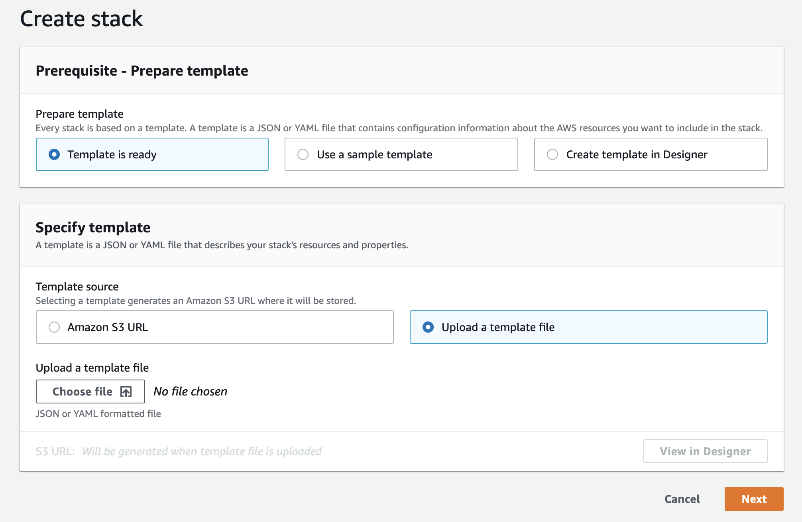
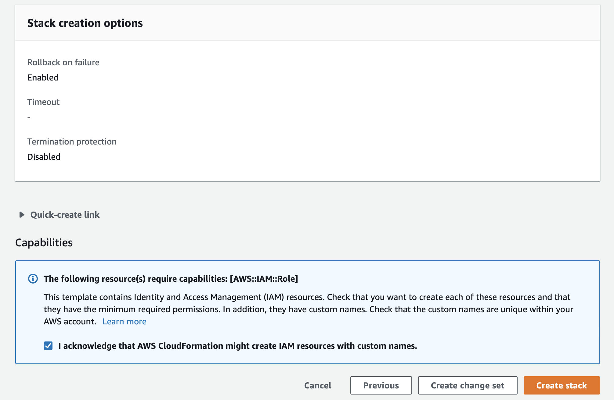
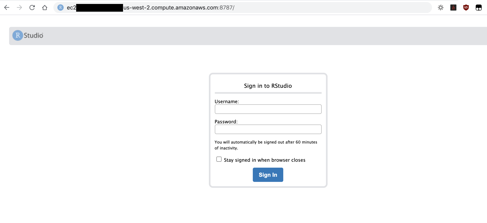
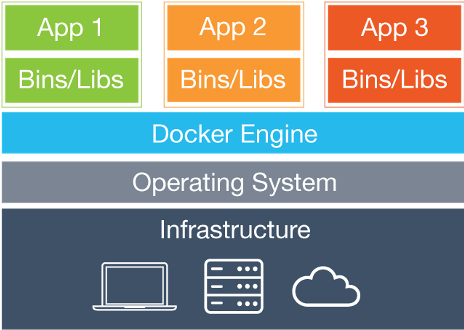
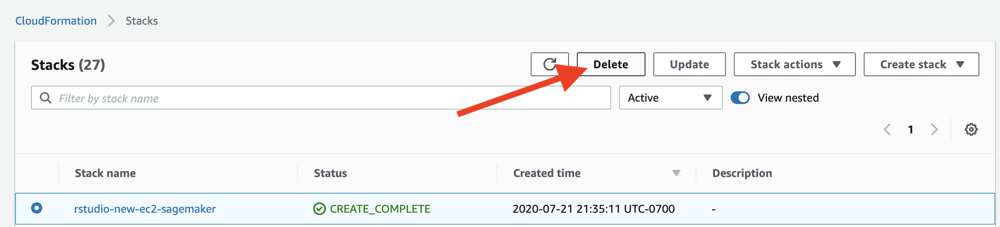

# Perform Statistical Simulation using Amazon SageMaker on RStudio

RStudio is a great IDE for data scientists and statisticians who code in R. You can develop your statistical modeling, simulations and machine learning scripts in RStudio locally or on an EC2 and leverage SageMaker Training and Processing to distribute the execution of the scripts to a remote compute instance. In this workshop, we will walk through steps to build a docker container for a social distancing simulation program that uses parallelism, and run the simulation using SageMaker Processing from a RStudio IDE. 

## Getting Started

### Lab 1: Deploy RStudio on EC2

We will deploy the resources using cloudformation in us-west-2 region to your Event Engine account. Please navigate to [CloudFormation console](https://us-west-2.console.aws.amazon.com/cloudformation/home?region=us-west-2#/stacks/create/template), select **Template is ready**, **Upload a template file**, and **Choose file** to upload the template yaml file [ec2_ubuntu_rstudio_sagemaker.yaml](./ec2_ubuntu_rstudio_sagemaker.yaml) provided to you. Hit **Next** to continue.



In Step 2 **Specify stack details**, you will be prompted to enter a **Stack name**, review and accept the [AGPL v3
license](http://www.gnu.org/licenses/agpl-3.0-standalone.html) for installing RStudio Server, and select an **EC2 key pair**. Then hit **Next**. 

In Step 3 **Configure stack options** page, we will bypass any options and keep default values, hit **Next**.

In Step 4 **Review**, please acknowledge and hit **Create Stack**. The stack creation will take about 5 minutes to get EC2 instance up and running, and another 5-10 minutes for RStudio to install some prerequisites.



Once the stack creation completes, go to **Output** tab to find the RStudio IDE login URL: ec2-xx-xxx-xxx-xxx.us-west-2.compute.amazonaws.com:8787. Copy the URL and paste it in your favorite browser. 



Login the RStudio instance with username **ubuntu** and password **rstudio7862**. [Note that this is a temporary environment for demonstration purposes. The use of public facing EC2 instance and simple login credential is *NOT* the best security practice to host your RStudio instance.]

### Lab 2: Create a Docker Container to run R scripts

#### Background

Docker is a software platform that allows you to build, test, and deploy applications quickly. Docker packages software into standardized units called containers that have everything the software needs to run including libraries, system tools, code, and runtime. Using Docker, you can quickly deploy and scale applications into any environment and know your code will run. 



A Docker image is a read-only template that defines your container. The image contains the code that will run including any definitions for any libraries and dependancies your code needs. A Docker container is an instantiated (running) Docker image. AWS provides [Amazon Elastic Container Registry (ECR)](https://aws.amazon.com/ecr/), an image registry for storing and quickly retrieving Docker images.

Docker can build images automatically by reading the instructions from a `Dockerfile`. A `Dockerfile` is a text document that contains all the commands a user could call on the command line to assemble an image. 

#### Scenario

Suppose that the [social distancing simulation program](./Submit_SageMaker_Processing_Job/Social_Distancing_Simulations_Parallel.R) was originally developed with R 3.4.1 *Single Candle* from a version of RStudio on ubuntu 16.04. The programs uses two libraries *foreach* and *doParallel* for parallelism purposes. We would like to run the simulation leveraging remote compute cluster exactly as developed, we need to either have the remote server satisfy all the dependency and version compatibility, which can be difficult to scale, or build a docker image that has all the dependencies installed in the layers and run it anywhere as a container. In this lab, we will create an image that has a R interpreter with dependent libraries to run the simulation and push the image to Amazon ECR so that, with the image, we will be able to run our R script the exact way we develop on any machine that may or may not have the compatible R or the R packages installed, as long as there is a Docker Engine on the host system. Below is the `Dockerfile` that describe the runtime requirement and how the container should be executed.

```dockerfile
FROM ubuntu:16.04

RUN apt-get -y update && apt-get install -y --no-install-recommends \
    wget \
    r-base \
    r-base-dev \
    apt-transport-https \
    ca-certificates

RUN R -e "install.packages(c('foreach', 'doParallel'), repos='https://cloud.r-project.org')"

ENTRYPOINT ["/usr/bin/Rscript"]
```

Each line is an instruction to create one layer:

- `FROM` creates a layer from the `ubuntu:16.04` Docker image.
- `RUN` executes command lines to create a new layer with results.
- `ENTRYPOINT` allows you to configure a container that will run as an executable.

See [Dockerfile](./Dockerfile) for actual file. This file describe what dependency (ubuntu 16.04, `foreach` and `doParallel` and what software and runtime to be included in the container image. 

In order to build a docker image from Dockerfile, you need to execute the following docker command in where the Dockerfile is

```bash
$ docker build -t $image_name .
$ docker images # to see the built image
```

#### Push the docker image to AWS Elastic Container Registry (ECR)

The following shell commands show how to interact with ECR from your terminal and push the docker image to ECR.

```bash
# Get the AWS account ID
account=$(aws sts get-caller-identity --query Account --output text)

# Get the region defined in the current configuration (default to us-west-2 if none defined)
region=$(aws configure get region)
region=${region:-us-west-2}

# Define the full image name on Amazon ECR
fullname="${account}.dkr.ecr.${region}.amazonaws.com/${image_name}:${tag}"

# If the repository doesn't exist in ECR, create it.
aws ecr describe-repositories --repository-names "${image_name}" > /dev/null 2>&1

if [ $? -ne 0 ]
then
    aws ecr create-repository --repository-name "${image_name}" > /dev/null
fi

# Get the login command from ECR and execute it directly
aws ecr get-login-password --region ${region} \
  | docker login \
      --username AWS \
      --password-stdin ${account}.dkr.ecr.${region}.amazonaws.com

# Tag and push the local image to Amazon ECR
docker tag ${image_name} ${fullname}
docker push ${fullname}
```

#### Putting all together

Execute the shell script [build_and_push_docker.sh](./build_and_push_docker.sh) to streamline the build and push process in the Terminal in your RStudio IDE. The script will build the Dockerfile as a image named `r_container` with the `latest` tag.

```bash
$ sh build_and_push_docker.sh r_container latest
```

You should be able to see your image in [ECR](https://us-west-2.console.aws.amazon.com/ecr/repositories?region=us-west-2). This image has all the dependencies to run our R script and can be used any time anywhere.

### Lab 3: R simulation using SageMaker Processing

The social distancing simulation program ([Social_Distancing_Simulations.R](./Submit_SageMaker_Processing_Job/Social_Distancing_Simulations.R)) runs a simulation of social distancing violation for given number of people in given space specification. It takes 4 positional input arguments: `x_length`, `y_length`, `num_people` and `max_iteration`. The first two specifies the area, `num_people` specifies the amount of people in the area, and `max_iteration` defines the number of iterations. We will run the simulation with the given parameters parallelly using multiple CPU cores. 

With SageMaker Processing, we will be able to leverage remote compute infrastructure to run the simulation and free up the local compute resources. Amazon SageMaker spins up a Processing job, takes your script, copies your data from Amazon Simple Storage Service (Amazon S3), and then pulls a processing container from ECR. The underlying infrastructure for a Processing job is fully managed by Amazon SageMaker. Cluster resources are provisioned for the duration of your job, and cleaned up when a job completes. The output of the Processing job is stored in the Amazon S3 bucket you specified. You can treat your RStudio instance as a launching station to submit simulation to remote compute with various parameters or input datasets. Complete SageMaker API is accessible through [Reticulate](https://rstudio.github.io/reticulate/) library that provides an R interface to make calls to Amazon SageMaker Python SDK. 

The essense of job submission is the following lines of code. We define what container to use (our previously created r_container), what compute resource does this job run one and what script we want to execute with what input parameters.

```R
processor <- sagemaker$processing$ScriptProcessor(role = role_arn,
                                                  image_uri = container,
                                                  command = list('/usr/bin/Rscript'),
                                                  instance_count = 1L,
                                                  instance_type = 'ml.m4.xlarge',
                                                  volume_size_in_gb = 5L,
                                                  max_runtime_in_seconds = 3600L,
                                                  base_job_name = 'social-distancing-simulation',
                                                  sagemaker_session = session)

processor$run(code = 'Social_Distancing_Simulations.R',
              arguments = list('--args', paste(x_length), paste(y_length), paste(num_people),
                               paste(max_iterations)))
```

We will execute the code line by line in the RStudio with the script [sagemaker_processing_submission.R](./sagemaker_processing_submission.R) to submit 5 additional simulations.

In our simulation, we are not interacting with any data from a S3 bucket. If need be, you can specify data from a S3 bucket as input and save any processing/simulation output back to S3 by specifying `inputs` and `outputs` arguments in `processor$run()` call. For example,

```R
input_data <- sagemaker$processing$ProcessingInput(source='s3://path/to/my/input-data.csv',
                                                   destination='/opt/ml/processing/input')
output_data <- sagemaker$processing$ProcessingOutput(source='/opt/ml/processing/output/simulation',
                                                     destination='s3://path/to/my/output/')
processor$run(code = 'Social_Distancing_Simulations.R',
              arguments = list('--args', paste(x_length), paste(y_length), paste(num_people),
                               paste(max_iterations)),
              inputs=list(input_data),
              outputs=list(output_data))
```

While the `Social_Distancing_Simulation.R` is executed within the container, the `input-data.csv` from S3 will be available at the path `/opt/ml/processing/input/` in the container and if you save the results into the path `/opt/ml/processing/output/simulation` within the container, they will be uploaded to specified S3 location. See the diagram below.


### Cleaning up

Once we completed the workshop, please delete the stack from the [CloudFormation console](https://us-west-2.console.aws.amazon.com/cloudformation/home?region=us-west-2#/stacks) by selecting the stack and hit **Delete**. This will clean up all the resources we have created for the workshop.




## Security

See [CONTRIBUTING](CONTRIBUTING.md#security-issue-notifications) for more information.

## License

This library is licensed under the MIT-0 License. See the [LICENSE](./LICENSE) file.

